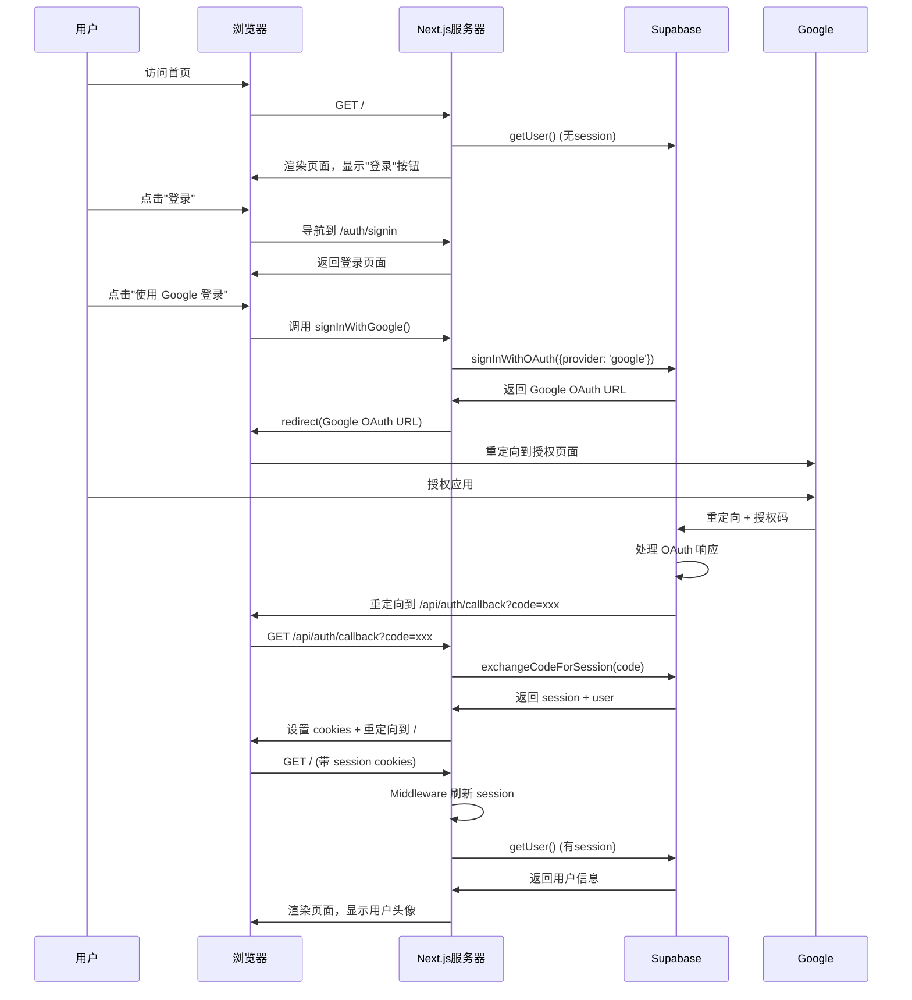

# Google 登录完整流程解析

## 📊 流程图

### 整体流程
```
用户点击"登录"
    ↓
前端跳转到 /auth/signin 页面
    ↓
用户点击"使用 Google 登录"
    ↓
调用 signInWithGoogle() Server Action
    ↓
Supabase 生成 Google OAuth URL
    ↓
重定向到 Google 授权页面
    ↓
用户在 Google 授权
    ↓
Google 重定向到 Supabase
    ↓
Supabase 处理 OAuth 响应
    ↓
Supabase 重定向到 /api/auth/callback?code=xxx
    ↓
服务器交换 code 获取 session
    ↓
设置认证 cookies
    ↓
重定向回首页
    ↓
Middleware 刷新 session
    ↓
Header 显示用户信息 ✅
```

### 详细时序图



## 🏗️ 代码架构

### 1. 文件组织结构

```
banana-website-clone/
├── lib/supabase/
│   ├── server.ts          # 服务器端 Supabase 客户端工厂
│   ├── client.ts          # 浏览器端 Supabase 客户端工厂
│   └── middleware.ts      # 会话刷新逻辑
├── app/
│   ├── actions/
│   │   └── auth.ts        # Server Actions (登录/登出)
│   ├── api/auth/
│   │   └── callback/
│   │       └── route.ts   # OAuth 回调处理器
│   └── auth/
│       ├── signin/
│       │   ├── page.tsx         # 登录页面 (Server Component)
│       │   └── signin-form.tsx  # 登录表单 (Client Component)
│       └── auth-code-error/
│           └── page.tsx         # 错误页面
├── components/
│   ├── header.tsx         # 导航栏 (Server Component)
│   └── user-nav.tsx       # 用户菜单 (Client Component)
└── middleware.ts          # Next.js 全局中间件
```

## 📝 代码详解

### 1. Supabase 客户端工厂

#### `lib/supabase/server.ts` - 服务器端客户端
```typescript
import { createServerClient } from '@supabase/ssr'
import { cookies } from 'next/headers'

export async function createClient() {
  const cookieStore = await cookies()  // Next.js 15+ 需要 await

  return createServerClient(
    process.env.NEXT_PUBLIC_SUPABASE_URL!,
    process.env.NEXT_PUBLIC_SUPABASE_ANON_KEY!,
    {
      cookies: {
        // 读取所有 cookies
        getAll() {
          return cookieStore.getAll()
        },
        // 设置 cookies（用于 session 管理）
        setAll(cookiesToSet) {
          try {
            cookiesToSet.forEach(({ name, value, options }) =>
              cookieStore.set(name, value, options)
            )
          } catch {
            // Server Component 中无法直接设置 cookies
            // 会在 Middleware 中处理
          }
        },
      },
    }
  )
}
```

**关键点**:
- 使用 `@supabase/ssr` 的 `createServerClient`
- 通过 Next.js 的 `cookies()` API 管理 cookies
- `getAll()`: 读取认证 cookies
- `setAll()`: 更新 session cookies（在 Route Handler 和 Middleware 中生效）

#### `lib/supabase/client.ts` - 浏览器端客户端
```typescript
import { createBrowserClient } from '@supabase/ssr'

export function createClient() {
  return createBrowserClient(
    process.env.NEXT_PUBLIC_SUPABASE_URL!,
    process.env.NEXT_PUBLIC_SUPABASE_ANON_KEY!
  )
}
```

**关键点**:
- 使用 `@supabase/ssr` 的 `createBrowserClient`
- 自动管理浏览器的 cookies
- 用于 Client Components

### 2. 认证流程核心

#### `app/actions/auth.ts` - Server Actions
```typescript
'use server'  // 标记为 Server Action

import { revalidatePath } from 'next/cache'
import { redirect } from 'next/navigation'
import { createClient } from '@/lib/supabase/server'

// Google 登录
export async function signInWithGoogle(origin: string) {
  const supabase = await createClient()

  // 调用 Supabase OAuth API
  const { data, error } = await supabase.auth.signInWithOAuth({
    provider: 'google',
    options: {
      redirectTo: `${origin}/api/auth/callback`,  // OAuth 完成后的回调 URL
    },
  })

  if (error) {
    console.error('Google 登录错误:', error)
    redirect('/error')
  }

  redirect(data.url)  // 重定向到 Google 授权页面
}

// 登出
export async function signOut() {
  const supabase = await createClient()
  await supabase.auth.signOut()
  revalidatePath('/', 'layout')  // 清除缓存
  redirect('/')
}
```

**流程解析**:
1. **signInWithGoogle()**:
   - 调用 `supabase.auth.signInWithOAuth()`
   - Supabase 生成 Google OAuth URL
   - `redirectTo` 指定 OAuth 完成后的回调地址
   - `redirect(data.url)` 跳转到 Google 授权页面

2. **signOut()**:
   - 调用 `supabase.auth.signOut()` 清除 session
   - `revalidatePath()` 清除 Next.js 缓存
   - 重定向到首页

#### `app/api/auth/callback/route.ts` - OAuth 回调处理器
```typescript
import { createClient } from '@/lib/supabase/server'
import { NextResponse } from 'next/server'

export async function GET(request: Request) {
  const requestUrl = new URL(request.url)
  const code = requestUrl.searchParams.get('code')  // Google 返回的授权码
  const next = requestUrl.searchParams.get('next') ?? '/'  // 登录后跳转的页面

  if (code) {
    const supabase = await createClient()
    // 🔑 关键: 交换授权码获取 session
    const { error } = await supabase.auth.exchangeCodeForSession(code)

    if (!error) {
      // 获取正确的重定向 URL
      const redirectUrl = getRedirectUrl(request, next)
      return NextResponse.redirect(redirectUrl)
    }
  }

  // 如果失败，重定向到错误页面
  const errorUrl = getRedirectUrl(request, '/auth/auth-code-error')
  return NextResponse.redirect(errorUrl)
}

// 多层回退机制获取重定向 URL
function getRedirectUrl(request: Request, path: string): string {
  const forwardedHost = request.headers.get('x-forwarded-host')  // Vercel/Netlify 提供
  const forwardedProto = request.headers.get('x-forwarded-proto')
  const host = request.headers.get('host')

  // 生产环境 - 优先使用 forwarded headers
  if (forwardedHost) {
    const protocol = forwardedProto || 'https'
    return `${protocol}://${forwardedHost}${path}`
  }

  // 备用: 使用 host header
  if (host) {
    return `https://${host}${path}`
  }

  // 备用: 使用环境变量
  const baseUrl = process.env.NEXT_PUBLIC_SITE_URL || process.env.VERCEL_URL
  if (baseUrl) {
    const url = baseUrl.startsWith('http') ? baseUrl : `https://${baseUrl}`
    return `${url}${path}`
  }

  // 最后备用: 使用 request URL 的 origin
  const { origin } = new URL(request.url)
  return `${origin}${path}`
}
```

**流程解析**:
1. **接收授权码**: 从 URL 参数中获取 `code`
2. **交换 session**: `exchangeCodeForSession(code)` 调用 Supabase API
3. **设置 cookies**: Supabase 自动设置认证 cookies
4. **重定向**: 使用智能重定向逻辑跳转到首页

**重定向逻辑**:
- 优先使用 `x-forwarded-host`（Vercel 等平台自动提供）
- 备用 `host` header
- 备用环境变量 `NEXT_PUBLIC_SITE_URL`
- 最后使用 request origin

### 3. 会话管理

#### `middleware.ts` - 全局中间件
```typescript
import { type NextRequest } from 'next/server'
import { updateSession } from './lib/supabase/middleware'

export async function middleware(request: NextRequest) {
  return await updateSession(request)
}

export const config = {
  matcher: [
    // 匹配所有路径，除了静态资源
    '/((?!_next/static|_next/image|favicon.ico|.*\\.(?:svg|png|jpg|jpeg|gif|webp)$).*)',
  ],
}
```

#### `lib/supabase/middleware.ts` - Session 刷新逻辑
```typescript
import { createServerClient } from '@supabase/ssr'
import { NextResponse, type NextRequest } from 'next/server'

export async function updateSession(request: NextRequest) {
  let supabaseResponse = NextResponse.next({ request })

  const supabase = createServerClient(
    process.env.NEXT_PUBLIC_SUPABASE_URL!,
    process.env.NEXT_PUBLIC_SUPABASE_ANON_KEY!,
    {
      cookies: {
        getAll() {
          return request.cookies.getAll()  // 读取请求中的 cookies
        },
        setAll(cookiesToSet) {
          // 设置到请求对象（用于后续处理）
          cookiesToSet.forEach(({ name, value }) =>
            request.cookies.set(name, value)
          )

          // 创建新响应
          supabaseResponse = NextResponse.next({ request })

          // 设置到响应对象（返回给浏览器）
          cookiesToSet.forEach(({ name, value, options }) =>
            supabaseResponse.cookies.set(name, value, options)
          )
        },
      },
    }
  )

  // 🔑 关键: 验证并刷新用户 session
  const { data: { user } } = await supabase.auth.getUser()

  return supabaseResponse
}
```

**作用**:
- 每个请求都会执行这个中间件
- 自动刷新即将过期的 session
- 验证用户身份
- 更新 cookies

### 4. UI 组件

#### `components/header.tsx` - 导航栏 (Server Component)
```typescript
import Link from "next/link"
import { Button } from "@/components/ui/button"
import { createClient } from "@/lib/supabase/server"
import { UserNav } from "./user-nav"

export async function Header() {
  const supabase = await createClient()
  // 🔑 在服务器端获取用户信息
  const { data: { user } } = await supabase.auth.getUser()

  return (
    <header>
      {/* Logo 和导航 */}

      {user ? (
        <UserNav user={user} />  // 已登录: 显示用户菜单
      ) : (
        <Button asChild>
          <Link href="/auth/signin">登录</Link>  // 未登录: 显示登录按钮
        </Button>
      )}
    </header>
  )
}
```

**关键点**:
- Server Component: 在服务器端渲染
- 直接调用 `getUser()` 获取用户信息
- 无需客户端 JavaScript 即可显示用户状态

#### `components/user-nav.tsx` - 用户菜单 (Client Component)
```typescript
'use client'

import { Avatar, AvatarFallback, AvatarImage } from '@/components/ui/avatar'
import { DropdownMenu } from '@/components/ui/dropdown-menu'
import { signOut } from '@/app/actions/auth'
import { useTransition } from 'react'

export function UserNav({ user }) {
  const [isPending, startTransition] = useTransition()

  const handleSignOut = () => {
    startTransition(async () => {
      await signOut()  // 调用 Server Action
    })
  }

  return (
    <DropdownMenu>
      <DropdownMenuTrigger>
        <Avatar>
          <AvatarImage src={user.user_metadata?.avatar_url} />
          <AvatarFallback>{user.email[0].toUpperCase()}</AvatarFallback>
        </Avatar>
      </DropdownMenuTrigger>
      <DropdownMenuContent>
        <DropdownMenuLabel>
          {user.user_metadata?.name}
          {user.email}
        </DropdownMenuLabel>
        <DropdownMenuItem onClick={handleSignOut}>
          退出登录
        </DropdownMenuItem>
      </DropdownMenuContent>
    </DropdownMenu>
  )
}
```

**关键点**:
- Client Component: 处理交互
- 使用 `useTransition` 显示加载状态
- 调用 Server Action 执行登出

#### `app/auth/signin/signin-form.tsx` - 登录表单
```typescript
'use client'

import { Button } from '@/components/ui/button'
import { signInWithGoogle } from '@/app/actions/auth'
import { useTransition } from 'react'

export function SignInForm() {
  const [isPending, startTransition] = useTransition()

  const handleGoogleSignIn = () => {
    startTransition(async () => {
      await signInWithGoogle(window.location.origin)  // 传递当前域名
    })
  }

  return (
    <Button onClick={handleGoogleSignIn} disabled={isPending}>
      {isPending ? '登录中...' : '使用 Google 登录'}
    </Button>
  )
}
```

**关键点**:
- Client Component: 需要访问 `window.location.origin`
- 调用 Server Action 启动 OAuth 流程
- `useTransition` 提供加载状态

## 🔐 安全机制

### 1. Cookie 管理
```
认证信息存储在 HttpOnly Cookies 中:
- sb-<project-ref>-auth-token
- sb-<project-ref>-auth-token-code-verifier
```

**安全特性**:
- `HttpOnly`: JavaScript 无法访问
- `Secure`: 仅 HTTPS 传输
- `SameSite`: 防止 CSRF 攻击

### 2. PKCE 流程
Supabase 使用 PKCE (Proof Key for Code Exchange) 增强安全性:

```
1. 客户端生成 code_verifier（随机字符串）
2. 计算 code_challenge = SHA256(code_verifier)
3. 请求授权时发送 code_challenge
4. Google 返回授权码
5. 交换 session 时发送 code_verifier 验证
```

### 3. Session 刷新
```
Middleware 在每个请求时:
1. 检查 session 有效性
2. 如果接近过期，自动刷新
3. 更新 cookies
4. 透明处理，用户无感知
```

## 🔄 完整数据流

### 登录流程数据
```
1. 用户点击"使用 Google 登录"
   ↓
2. signInWithGoogle() 调用
   Request: { provider: 'google', redirectTo: '...' }
   ↓
3. Supabase 生成 OAuth URL
   Response: { url: 'https://accounts.google.com/...' }
   ↓
4. 重定向到 Google
   ↓
5. 用户授权
   ↓
6. Google → Supabase
   携带: authorization_code
   ↓
7. Supabase → 你的网站
   URL: /api/auth/callback?code=xxx
   ↓
8. exchangeCodeForSession(code)
   Request: { code: 'xxx' }
   Response: { session: {...}, user: {...} }
   ↓
9. 设置 Cookies
   sb-xxx-auth-token: <JWT>
   ↓
10. 重定向到首页
    ↓
11. Middleware 验证 session
    ↓
12. Header 渲染用户信息
```

### Session 数据结构
```typescript
{
  user: {
    id: "uuid",
    email: "user@gmail.com",
    user_metadata: {
      avatar_url: "https://lh3.googleusercontent.com/...",
      email: "user@gmail.com",
      email_verified: true,
      full_name: "张三",
      iss: "https://accounts.google.com",
      name: "张三",
      picture: "https://lh3.googleusercontent.com/...",
      provider_id: "1234567890",
      sub: "1234567890"
    },
    app_metadata: {
      provider: "google",
      providers: ["google"]
    }
  },
  access_token: "JWT token...",
  refresh_token: "refresh token...",
  expires_at: 1735689600
}
```

## 🎯 关键技术点

### 1. Server Components vs Client Components
```
Server Components (服务器组件):
✅ header.tsx - 在服务器端获取用户信息
✅ signin/page.tsx - 静态内容

Client Components (客户端组件):
✅ signin-form.tsx - 需要 window 对象
✅ user-nav.tsx - 处理交互(点击、下拉菜单)
```

### 2. Server Actions
```typescript
'use server'  // 必须在文件顶部

// 这些函数在服务器端执行:
- 可以访问环境变量
- 可以直接操作数据库
- 可以设置 cookies
- 自动处理序列化
```

### 3. Middleware 执行时机
```
每个请求都会经过 Middleware:
Request → Middleware → Route Handler/Page → Response
         ↓
    updateSession()
    验证并刷新 session
```

## 📊 性能优化

### 1. Server Components 优势
- Header 在服务器端渲染，减少客户端 JS
- 用户信息随 HTML 一起发送，无额外请求
- 首屏渲染更快

### 2. 缓存策略
```typescript
revalidatePath('/', 'layout')  // 登出时清除缓存
```

### 3. Cookie 自动管理
- Middleware 自动刷新 session
- 无需客户端定时器
- 减少不必要的 API 调用

## 🛠️ 调试技巧

### 查看 Cookies
```javascript
// 浏览器控制台
document.cookie

// 或在 Application → Cookies 面板查看
```

### 查看 Session
```typescript
// 在 Server Component 中
const supabase = await createClient()
const { data: { session } } = await supabase.auth.getSession()
console.log('Session:', session)
```

### 查看 Middleware 日志
```typescript
// lib/supabase/middleware.ts
export async function updateSession(request: NextRequest) {
  console.log('Middleware 执行:', request.url)
  // ...
}
```

这就是完整的 Google 登录实现！整个系统通过 Supabase 提供的 SSR 库与 Next.js 深度集成，实现了安全、高效的认证流程。
